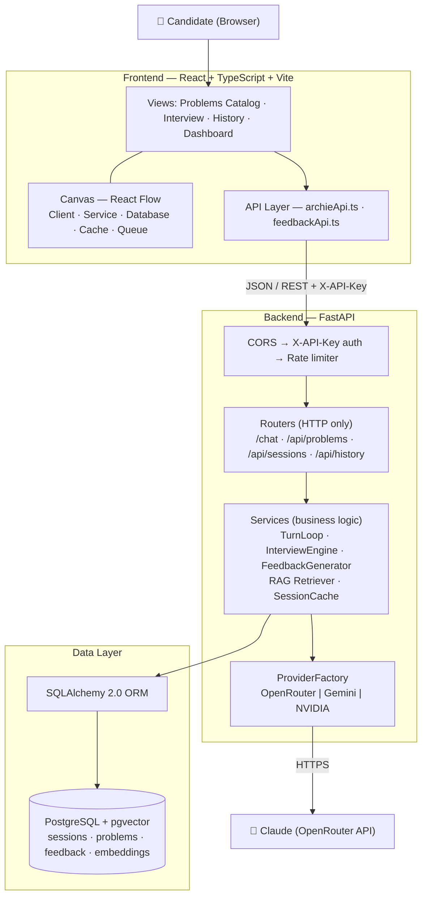
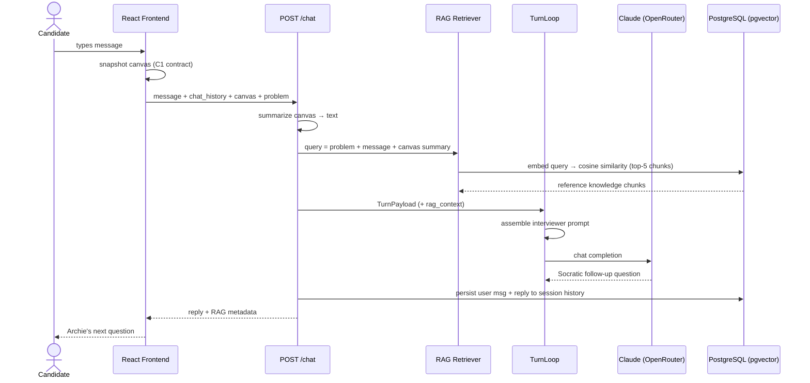
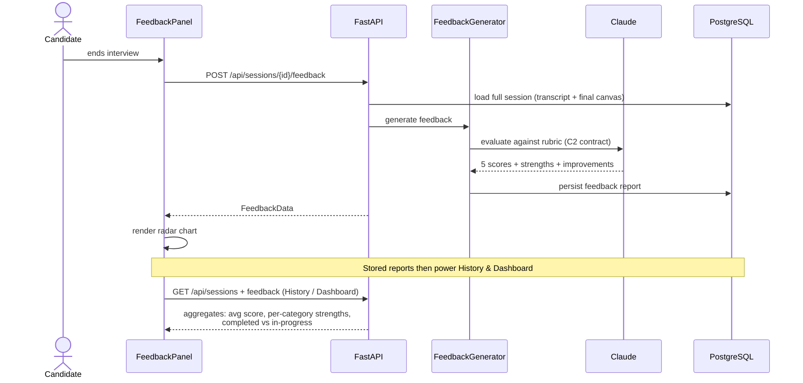
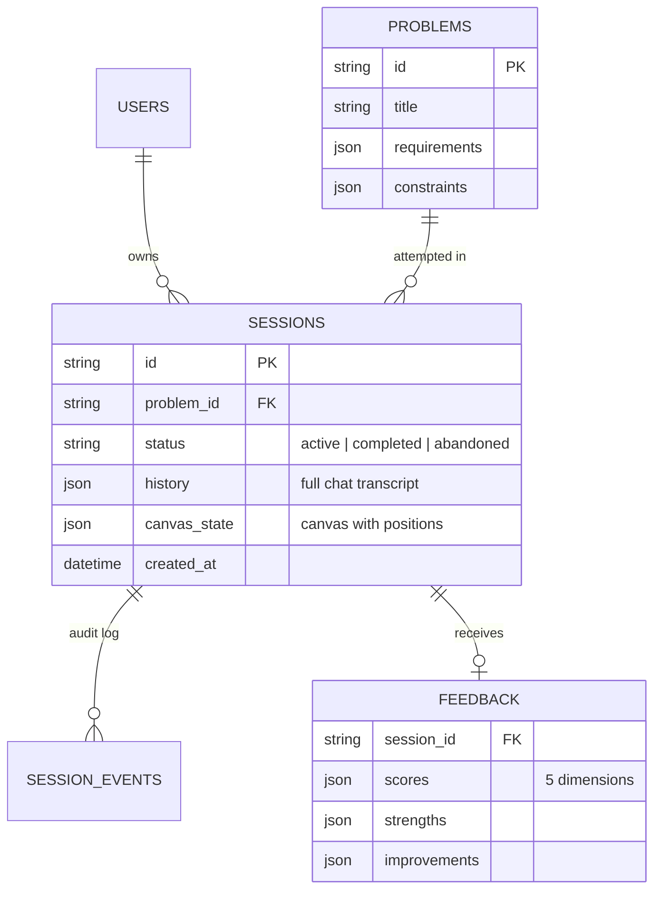
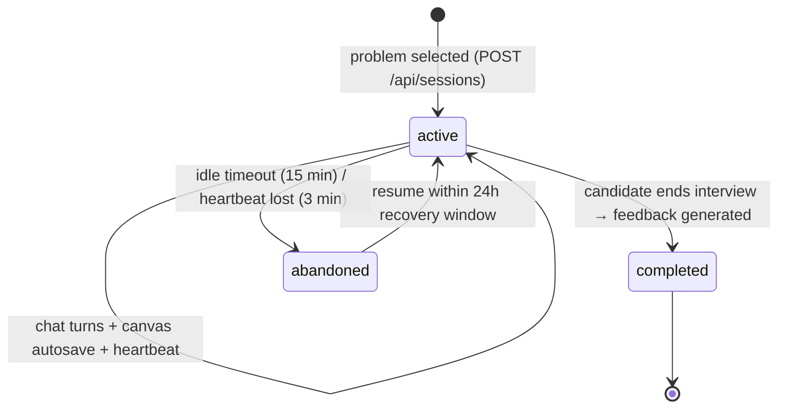

# Archie — Architecture

AI-powered system design interview platform.
**Stack:** React 18 + TypeScript + React Flow (Vite) · FastAPI + Python 3.11 · SQLAlchemy 2.0 · PostgreSQL + pgvector · Claude via OpenRouter

---

## 1. High-Level System Architecture

## 2. One Interview Turn — Request Lifecycle (with RAG)

---

## 3. Feedback & Progress Analytics

---

## 4. Data Model & Session Lifecycle

## 9. Tech Stack Summary

| Layer | Technology | Why |
|---|---|---|
| UI | React 18 + TypeScript (Vite) | Fast dev loop, type-safe API contracts |
| Diagramming | React Flow + ELK auto-layout | Interactive canvas with programmatic layout |
| API | FastAPI + Pydantic v2 | Async, auto-validated JSON, OpenAPI docs for free |
| AI | Claude via OpenRouter (provider-pluggable) | Quality Socratic questioning; swappable via `.env` |
| Retrieval | pgvector + sentence-transformers | Vector search inside the existing database |
| Persistence | PostgreSQL + SQLAlchemy 2.0 | Durable sessions, JSON columns for transcript/canvas |
| Security | X-API-Key dependency + CORS + rate limiting | Simple, constant-time key comparison |
