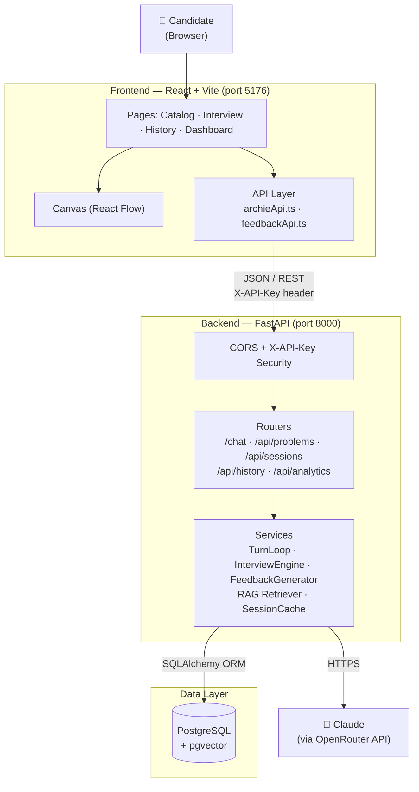
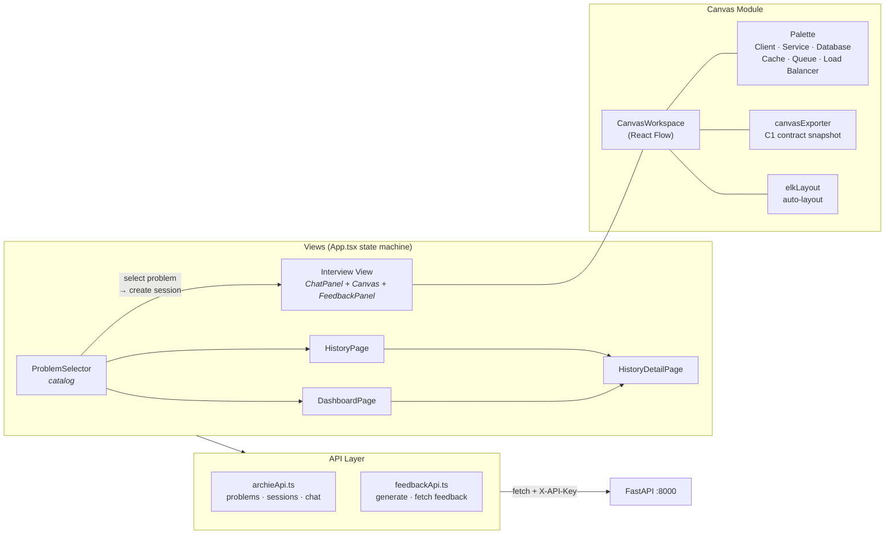
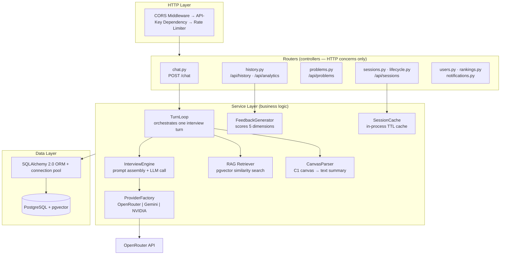
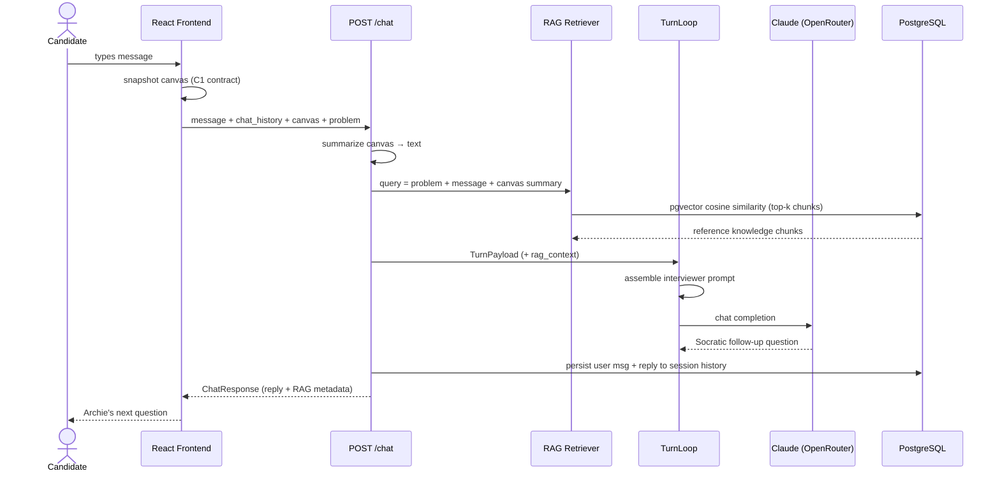
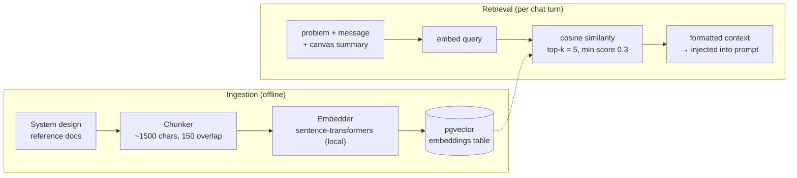
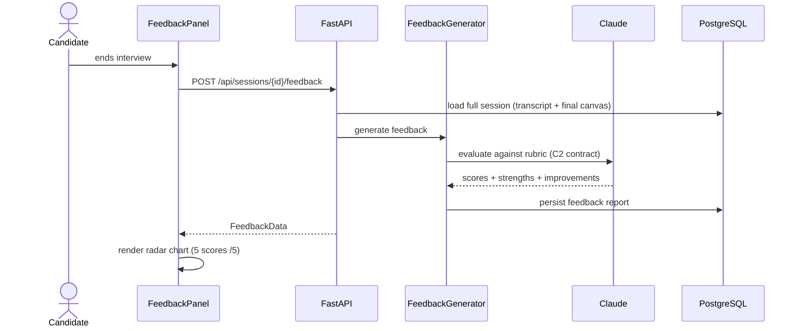
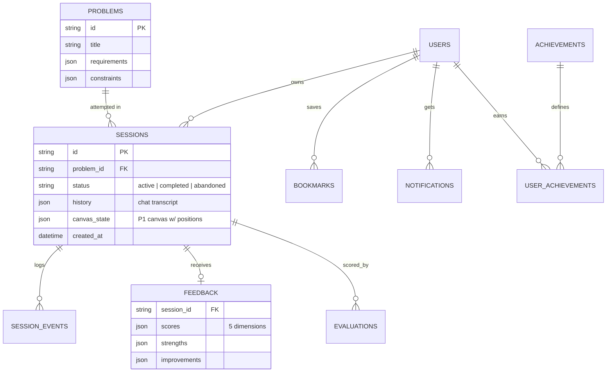
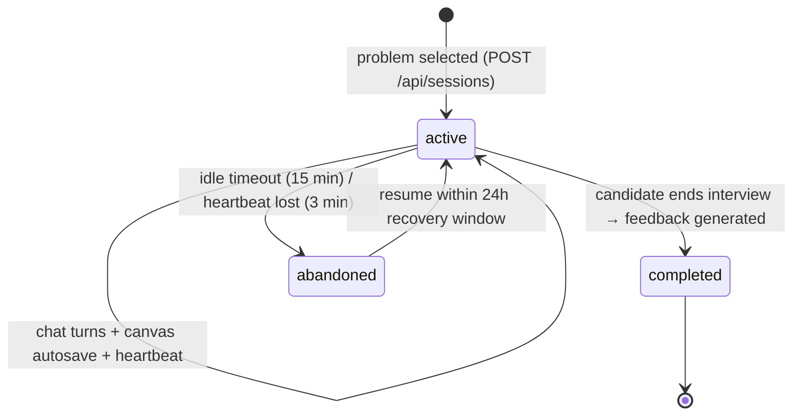

# Archie — Architecture

AI-powered system design interview platform.
**Stack:** React 18 + TypeScript + React Flow (Vite) · FastAPI + Python 3.11 · SQLAlchemy 2.0 · PostgreSQL + pgvector · Claude via OpenRouter

---

## 1. High-Level System Overview

**Talking points**

- Classic three-tier architecture with an AI service layer embedded in the backend.
- The frontend never talks to the LLM directly — the API key stays server-side; all traffic goes through the FastAPI gateway.
- Every request carries an `X-API-Key` header validated by a FastAPI security dependency.
- All state lives in PostgreSQL — the HTTP API itself is stateless, so a server restart never loses an interview.

---

## 2. Frontend Architecture

**Talking points**

- `App.tsx` is a small state machine: `catalog → interview → history → history-detail → dashboard`.
- The interview view is a split layout: chat/feedback tabs on the left, the React Flow canvas on the right.
- The canvas exports a **C1 contract** snapshot (`{id, type, label, position}` nodes, `{from, to}` edges) — a locked schema shared between the frontend and AI engine teams.
- Configuration (`config.ts`) reads `VITE_API_BASE_URL` / `VITE_X_API_KEY` from env at build time.

---

## 3. Backend Layered Architecture

**Talking points**

- Strict layering: routers handle HTTP only; all business logic lives in services; services are the only layer touching the ORM.
- `ProviderFactory` abstracts the LLM behind a common interface — swapping Claude for Gemini or NVIDIA is a one-line `.env` change (`LLM_PROVIDER`).
- Hot session reads come from an in-process TTL cache (`SessionCache`) instead of hitting PostgreSQL on every poll.
- Routers are mounted twice: `/api` (backward-compatible) and `/api/v1` (canonical) for painless versioning.

---

## 4. One Interview Turn — Request Lifecycle

**Talking points**

- The canvas snapshot travels with **every** message — the AI interviewer literally sees the architecture diagram and can challenge it.
- RAG grounds the interviewer in real system design knowledge; retrieval failure degrades gracefully (turn continues without context).
- Persistence is isolated in its own DB session — a write failure never breaks the HTTP response.
- TurnLoop is stateless; all state travels in the request, so the backend scales horizontally.

---

## 5. RAG Pipeline

**Talking points**

- Two phases: offline ingestion (chunk → embed → store) and online retrieval on every chat turn.
- Embeddings live in PostgreSQL via **pgvector** — no separate vector database to operate.
- A minimum similarity score filters out irrelevant chunks; the response reports which topics were used (`rag` metadata).

---

## 6. Feedback Generation

**Talking points**

- Scored on five dimensions: **Requirements · Scalability · Reliability · Communication · Tradeoffs** (each 1–5).
- The evaluation sees the *entire* session — full transcript plus the final canvas — not just the last message.
- The **C2 feedback contract** locks the JSON shape so frontend, feedback generator, and dashboard were built in parallel.
- Stored reports power the History detail view and all Dashboard aggregates.

---

## 7. Data Model (core tables)

**Talking points**

- `sessions` is the heart: the full chat transcript and the positioned canvas are stored as JSON on the session row — one read restores an entire interview.
- Two canvas shapes by design: **C1** (no positions, sent to the LLM) vs **P1** (with positions, persisted for pixel-perfect restore).
- `session_events` is an append-only audit trail of lifecycle transitions.
- Supporting tables (bookmarks, notifications, achievements, daily challenges) are built but headless-ready for future UI.

---

## 8. Session Lifecycle

**Talking points**

- Heartbeats detect dropped clients; idle sessions are reaped automatically.
- An abandoned interview can be resumed within a 24-hour recovery window — canvas and transcript restore exactly as left.
- Status drives the UI: History filters on it, and the Dashboard splits completed vs in-progress.

---

## 9. Tech Stack Summary

| Layer | Technology | Why |
|---|---|---|
| UI | React 18 + TypeScript (Vite) | Fast dev loop, type-safe API contracts |
| Diagramming | React Flow + ELK auto-layout | Interactive canvas with programmatic layout |
| API | FastAPI + Pydantic v2 | Async, auto-validated JSON, OpenAPI docs for free |
| AI | Claude via OpenRouter (provider-pluggable) | Quality Socratic questioning; swappable via `.env` |
| Retrieval | pgvector + sentence-transformers | Vector search inside the existing database |
| Persistence | PostgreSQL + SQLAlchemy 2.0 | Durable sessions, JSON columns for transcript/canvas |
| Security | X-API-Key dependency + CORS + rate limiting | Simple, constant-time key comparison |
